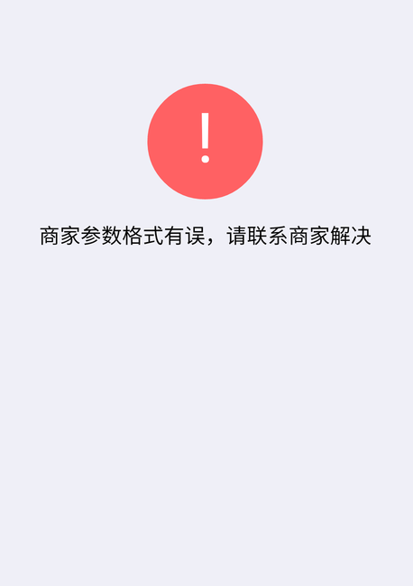

# 在APP的webview中使用微信支付时遇到的问题

### 场景：公司开发了一个APP，这个APP要嵌入几个H5的页面，其中有个页面需要用到微信支付，打开微信APP进行支付

### 过程：

1. 一开始也没有报错，但就是微信支付调不出来，比对文档发现，ip地址需要时用户端的ip地址，引入了一个第三方的库（[http://httpbin.org/ip](http://httpbin.org/ip)），获取ip地址
2. ip地址的问题解决了，在浏览器上可以完成支付了，但是在app中出现如下错误（在Android中有问题，IOS下没问题）
	
	
	郁闷，官网解释是	
	* 当前调起H5支付的referer为空导致，一般是因为直接访问页面调起H5支付，请按正常流程进行页面跳转后发起支付，或自行抓包确认referer值是否为空
	* 如果是APP里调起H5支付，需要在webview中手动设置referer，如(Map extraHeaders = new HashMap();extraHeaders.put("Referer", "商户申请H5时提交的授权域名");//例如 http://www.baidu.com ))
3. 根据微信的提示，在APP里设置了referer，但是还是商家参数格式有误，请联系商家解决，原因是referer还是为空，webview打开的第一个页面是可以取到referer的，但打开里面的子页面referer就为空了。
4. 后来经过Android开发人员绞尽脑汁的研究，使得里面的子页面也能带上referrer，（[http://blog.csdn.net/jxmy_1989/article/details/53924523](http://blog.csdn.net/jxmy_1989/article/details/53924523) 这篇文章可能又帮助）可以跳转了，但是问题又来了，不再提示那个商家参数格式有误了，而是提示O(∩_∩)O忘记提示什么了，原因好像是请求头没有加上，（百度一下提示的错误信息结果就出来了）
5. 微信支付终于可以在APP的webview里面使用了